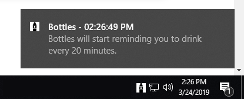

### Bottles💧



A simple "drink water, silly" reminder app for Windows 10 written in Python. Bottles sends a Windows Toast Notification 
every 20 minutes reminding you to drink water. It can be closed from its tray icon.

A personal project still under development. Written in Python.


#### Install:
A  batch file is provided that copies `Bottles.exe` into `C:\ProgramData\Microsoft\Windows\Start Menu\Programs\Startup\` 
```cmd
git clone https://github.com/heesemonster/bottles
cd bottles
install.bat
```

`Bottles.exe` can be manually copied or directly run from `/bottles/dist/Bottles.exe`

Right-click and select `Quit` on the tray icon to quit.

#### Uninstall:
The uninstall batch file finds and deletes `Bottles.exe` in `C:\ProgramData\Microsoft\Windows\Start Menu\Programs\Startup\`
```cmd
uninstall.bat
```

#### Build:
.exe builds are done using`pyinstaller` - `main.spec` is included.

#### Contribute:
However/if you'd like. The below TO-DO is always up-to-date.

#### TO-DO:
* **Reduce file size** - it's currently @ 10 MB. Still a work in progress, like all of us are on the insde.
* **Allow for custom durations and intervals** - this functionality is semi-obvious
* **More creative and colorful messages** - water is fun (?)

#### Credit:
* Tray/Notification icon made by Freepik from www.flaticon.com
* https://github.com/jithurjacob/Windows-10-Toast-Notifications
* https://github.com/Infinidat/infi.systray